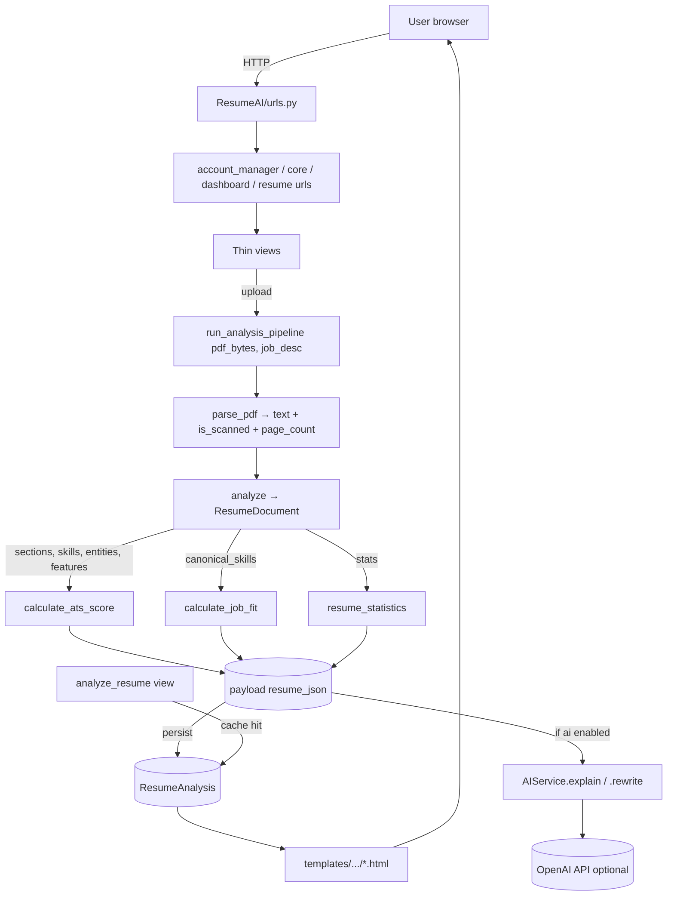
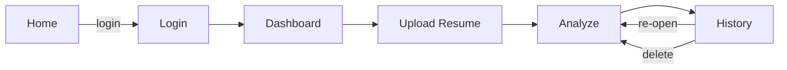
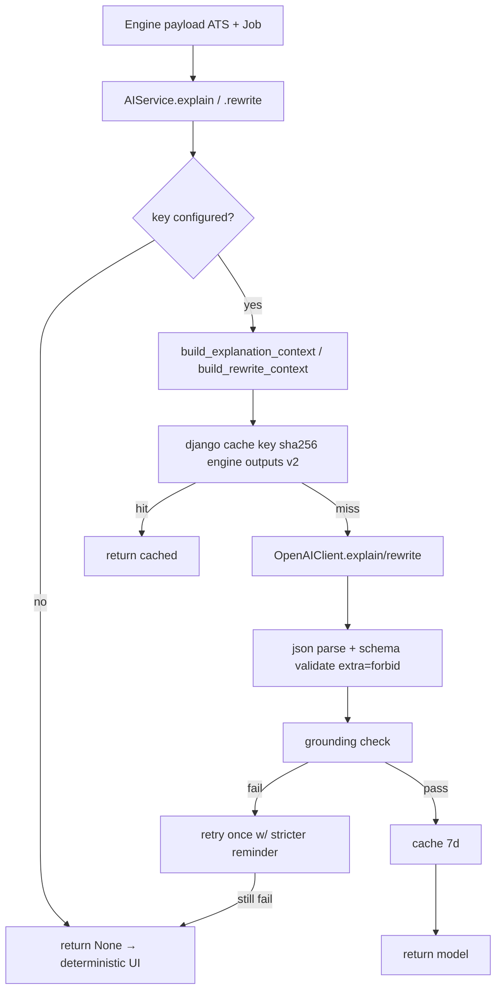

# ResumeAI — Project Workflow

> Single source of truth for how ResumeAI is built, wired, and extended.
> Generated by reading the actual source. Every path, class, and function name
> below refers to real code in this repository (Django 5.2, Python 3.12).

---

## 1. Project Purpose & Main Features

ResumeAI is an AI-powered resume analysis web app. A user uploads a **PDF resume**,
optionally pastes a **job description**, and receives:

- An **ATS compatibility score** (0–100) graded across a weighted 10-category rubric.
- A **job-match percentage** against the pasted JD (weighted 6-dimension composite).
- **Strengths, improvement areas, and recommendations** — prioritized and specific.
- **Missing-experience insights** (e.g. "JD asks 5+ yrs; resume shows ~3").
- **AI explanations + grounded rewrite suggestions** (OpenAI, optional, degrades gracefully).
- **Persistent history** — every analysis is cached so revisiting is instant.

Design: backend-first, server-rendered Django (no DRF / no JS framework). The
analysis is **deterministic** (the engines always run); the OpenAI layer only
explains and rewrites using that engine output as ground truth.

---

## 2. Folder / File Structure

```text
ResumeAI/
├── ResumeAI/                 # Django project config (settings, root URLs, wsgi/asgi)
│   ├── settings.py           # Config via python-decouple; DB, storage, AI, email
│   ├── urls.py               # Root URL router -> app urls
│   ├── wsgi.py / asgi.py
├── account_manager/          # Auth + account (uses built-in User; NO custom models)
│   ├── views.py              # login, register, logout, password reset, profile
│   ├── forms.py              # RegisterForm, LoginForm (email→username), CustomSetPasswordForm
│   ├── urls.py
├── core/                     # Public landing page (home)
│   ├── views.py (home)  models.py (empty)  urls.py  tests.py
├── dashboard/                # Authenticated dashboard (stats + recent resumes)
│   ├── views.py (dashboard)  urls.py  tests.py
├── resume/                   # Core domain: upload, analysis, scoring, job-match
│   ├── views.py              # upload_resume, analyze_resume, resume_history, delete_resume
│   ├── services.py           # run_analysis_pipeline, build_cache_key, context_from_payload
│   ├── models.py             # Resume, ResumeAnalysis
│   ├── forms.py              # ResumeForm
│   ├── analyzer.py           # ResumeDocument dataclass + analyze() single-pass
│   ├── text_extractor.py     # parse_pdf (pdfplumber, scanned-PDF flag)
│   ├── ats_engine.py         # CATEGORY_WEIGHTS (100) + calculate_ats_score()
│   ├── job_matcher.py        # MATCH_WEIGHTS (100) + calculate_job_fit()
│   ├── skills.py             # Canonical skill taxonomy + category weights
│   ├── utils.py              # detect_skills, resume_statistics, email/phone/linkedin checks
│   ├── nlp/                  # NLP building blocks
│   │   ├── aliases.py        # EXTRA_ALIASES (JS→JavaScript, ML→Machine Learning, ...)
│   │   ├── skill_extractor.py# canonical_skills / extract_skills (alias resolution)
│   │   ├── sections.py       # detect_sections, section_coverage
│   │   ├── entities.py       # degrees, certs, titles, companies, years-of-experience
│   │   ├── features.py       # action verbs, bullets, quantified achievements, dates
│   │   └── normalize.py      # tokenize, lemmatize (spaCy w/ fallback), redact_contact
│   ├── ai/                   # Optional OpenAI layer (V2)
│   │   ├── client.py         # OpenAIClient (thin SDK wrapper) + AIUnavailable/AIResponseError
│   │   ├── prompts.py        # build_explanation_context / build_rewrite_context
│   │   ├── schemas.py        # Pydantic AIExplanation, AIRewrite, ExplanationItem, RewriteSuggestion
│   │   └── service.py        # AIService (orchestration: prompt→call→validate→ground→cache)
│   ├── admin.py              # Resume + ResumeAnalysis admin registrations
│   ├── migrations/           # 0001..0005 (incl. AI cache fields)
│   └── tests.py              # NLP, ATS, job-match, pipeline, view integration tests
├── templates/                # Shared HTML (base.html, components/, account/, resume/, dashboard/, core/, registration/, 404/500)
├── static/                   # css/style.css (design system), js/main.js, vendors, images
├── docs/BACKEND_ARCHITECTURE.md
├── media/  screenshots/      # dev upload storage / README assets
├── manage.py  requirements.txt  .env.example  README.md
```

---

## 3. Architecture & Request / Data Flow

**Single-pass principle:** the PDF is parsed once into a `ResumeDocument`; the ATS
scorer, job matcher, and dashboard all consume that same object — no stage re-scans
the raw text.



### The analysis payload (the central contract)

`run_analysis_pipeline(pdf_bytes, job_description)` returns
`(_build_context(payload), payload)`. `payload` keys:

- `_meta` → `{ cache_key, version (1) }`
- `text`, `is_scanned`, `page_count`
- `stats` → word/char counts + has_email/phone/linkedin/github
- `found_skills`, `missing_skills`
- `ats` → `calculate_ats_score(...)` output
- `job` → `calculate_job_fit(...)` output

The same `payload` is stored on `ResumeAnalysis.resume_json` and re-rendered on
cache hits — so the view never re-parses or re-scores.

---

## 4. Major User Workflows

1. **Register / Log in** → `account_manager` (built-in Django `User`). Email-or-username
   login; password-reset emails via SMTP.
2. **Upload resume** (`resume/upload/`) → `ResumeForm` (title + PDF + optional JD + optional
   JD image). Creates `Resume` + `ResumeAnalysis`, redirects to `analysis/<id>/`.
3. **Analyze** (`resume/analysis/<id>/`) → reads PDF bytes, runs the pipeline (or serves
   `resume_json` cache when `sha1(pdf+JD)` matches), persists scores, optionally calls AI,
   renders two score rings (ATS + Job Match), breakdown, strengths, gaps, matching/missing
   skills, and AI cards.
4. **History** (`resume/history/`) → list of the user's resumes (`is_deleted=False`) with
   quick **View / Download / Delete**.
5. **Dashboard** (`dashboard/`) → aggregate stats (avg ATS, highest ATS, best job match) +
   recent 5 resumes.
6. **Profile** (`account/profile/`) → account info + security actions.



---

## 5. Backend: URLs, Views, Services, Models, Key Functions

### URL routing (`ResumeAI/urls.py`)
`admin/` → `admin.site.urls`; `""` → `core.urls`; `account/` → `account_manager.urls`;
`dashboard/` → `dashboard.urls`; `resume/` → `resume.urls`. Static media served when
`DEBUG`.

| App | Path | View | Name |
|-----|------|------|------|
| core | `""` | `home` | `home` |
| account_manager | `login/` `register/` `logout/` `profile/` `password-reset/...` | `UserLoginView`, `register`, `user_logout`, `profile`, Django password-reset views | `login`,`register`,`logout`,`profile`,`password_reset`,… |
| dashboard | `""` | `dashboard` | `dashboard` |
| resume | `upload/` `history/` `delete/<id>/` `analysis/<id>/` | `upload_resume`, `resume_history`, `delete_resume`, `analyze_resume` | `upload_resume`,`resume_history`,`delete_resume`,`analyze_resume` |

### Views (`resume/views.py`) — all resume views are `@login_required`
- `upload_resume` — `ResumeForm`; create `Resume` + `ResumeAnalysis(job_description, job_image)`; redirect to analyze.
- `analyze_resume` — `get_object_or_404(Resume, id, user, is_deleted=False)`; `get_or_create(ResumeAnalysis)`;
  `read_file_bytes(resume.file)`; if `None` → render cached `resume_json`; short-circuit if
  stored `_meta.cache_key == sha1(pdf+JD)`; else `run_analysis_pipeline`; persist `ats_score`,
  `job_match_score`, `recommendations`, `strengths`, `improvement_areas`, `resume_json`; if
  `ai_service._enabled`: `explain()` + `rewrite()`, persist `ai_explanation`/`ai_rewrite`.
  Pipeline failure → message + redirect to history.
- `resume_history` — filter `is_deleted=False`, `select_related("analysis")`.
- `delete_resume` — `_delete_storage_file` for PDF + JD image, delete analysis + resume.

### Service layer (`resume/services.py`)
- `read_file_bytes(file_obj)` → bytes | None.
- `build_cache_key(pdf_bytes, job_description)` → `sha1` (salt `CACHE_VERSION=1`).
- `run_analysis_pipeline(pdf_bytes, job_description)` → parse → analyze →
  `calculate_ats_score(text, doc)` → `calculate_job_fit(ats["detected_skills"], job_description, doc)`
  → `detect_skills` → `resume_statistics`; returns `(_build_context(payload), payload)`.
- `context_from_payload(payload)` → template-ready dict (adds `ats_breakdown` list with
  `percent`, `job_missing_skills`, `job_recommendations`, etc.).

### Models — see §7.

### Key engine functions
- `ats_engine.calculate_ats_score(text, doc=None)` → `{ats_score (min 100), grade, breakdown,
  strengths, improvements, recommendations, detected_skills}`.
- `job_matcher.calculate_job_fit(resume_skills, job_description, doc=None)` → `{job_fit_score,
  matching_skills, missing_skills, extra_skills, recommendations, match_confidence,
  missing_required_skills, missing_experience, ...}`; returns `job_fit_score=None` when no JD.
- `analyzer.analyze(text, is_scanned, page_count)` → `ResumeDocument` (single pass).
- `nlp.skill_extractor.canonical_skills(text)` — alias-aware canonical extraction.

---

## 6. Frontend: Templates, Components, Forms & (no) API interactions

Server-rendered only. No fetch/XHR to a backend API — every interaction is a Django
form POST or a link.

- **Base** `templates/base.html` → `.admin-shell` with `components/sidebar.html`,
  `components/navbar.html`, `components/footer.html`; loads Bootstrap 5, Bootstrap Icons,
  Inter font, `static/css/style.css` (design system w/ light/dark tokens), and
  `static/js/main.js`.
- **Pages**: `core/home.html`, `account/{login,register,profile,password_reset*}.html`
  (`auth_base.html` / `public_base.html` for non-authed), `dashboard/index.html`,
  `resume/{upload,analysis,history}.html`, `404.html`/`500.html`.
- **Forms** (manual Bootstrap widget styling, **not** crispy forms — each field sets
  `widget=...attrs={"class": ...}`):
  - `ResumeForm` (`resume/forms.py`): `title` (TextInput), `file` (ClearableFileInput,
    `accept` set), `job_description` (Textarea, optional), `job_image` (ImageField, optional).
  - `RegisterForm` (`account_manager/forms.py`): `first_name, username, email, password`.
  - `LoginForm`: username/password/remember_me; `clean()` resolves email→username.
  - `CustomSetPasswordForm` for password reset.
- **JS** (`static/js/main.js`): sidebar mini-toggle (localStorage), light/dark theme toggle
  (localStorage + `prefers-color-scheme`), password show/hide, drag-and-drop upload zone,
  sidebar backdrop. No backend calls.
- **Rendering of scores**: `analysis.html` uses `--ring-pct` CSS var for the score ring and
  branch badges by `ats_score` / `job_fit_score`; draws per-category `ats_breakdown` bars.

---

## 7. Database Models & Relationships

No custom user — `django.contrib.auth.models.User` is used directly; `account_manager/models.py`
is empty.

```mermaid
erDiagram
    User ||--o{ Resume : owns
    Resume ||--|| ResumeAnalysis : "one-to-one (analysis)"
    Resume {
        int id
        FK user
        string title
        file file
        datetime uploaded_at
        bool is_deleted
        datetime deleted_at
    }
    ResumeAnalysis {
        int id
        FK resume
        int ats_score
        int job_match_score
        text job_description
        image job_image
        json resume_json
        json recommendations
        json strengths
        json improvement_areas
        json ai_explanation
        json ai_rewrite
        int ai_prompt_version
        string ai_model
        datetime analyzed_at
    }
```

- `Resume.user` → `User` (CASCADE, `related_name="resumes"`); `Meta.ordering = ["-uploaded_at"]`.
- `ResumeAnalysis.resume` → `Resume` (`OneToOne`, `related_name="analysis"`).
- Soft delete via `is_deleted` / `deleted_at` (history filters on `is_deleted=False`).
- AI outputs cached as JSON (`ai_explanation` = `AIExplanation`, `ai_rewrite` = `AIRewrite`).
- Migrations: `0001_initial` … `0005_add_ai_cache_fields` (no applied-migration edits).

---

## 8. Authentication & Authorization

- **Framework:** Django built-in auth (`django.contrib.auth`). Password validators in
  `settings.py` (min length 8 + the built-ins) **plus** a custom regex in `RegisterForm.clean_password`
  (must contain upper, lower, digit, and a special char from `!@#$%^&*(),.?":{}|<>`,
  validated via `validate_password`).
- **Login:** `UserLoginView` (Django `LoginView`) with `LoginForm` — accepts email *or*
  username (`clean()` looks up `User.objects.get(email__iexact=username)` then `authenticate`);
  `redirect_authenticated_user=True`; success → `dashboard`. Email lowercased on register.
- **Authorization:** every resume view is `@login_required`; `analyze_resume` filters by
  `user=request.user`; history uses `is_deleted=False` and per-user queryset so users only
  see their own rows (verified by `test_history_lists_resumes_for_current_user_only`).
- **Password reset:** Django `PasswordResetView` + `PasswordResetConfirmView`
  (`CustomSetPasswordForm`); email via SMTP; template `registration/password_reset_email.html`.
- **CSRF:** all POSTs protected; `CSRF_TRUSTED_ORIGINS` populated from env for HTTPS hosts.
- **Other hardening:** `SecurityMiddleware`, `XFrameOptionsMiddleware` (deny framing),
  template auto-escaping (XSS), secrets in `.env` (gitignored).

---

## 9. AI / ATS / Job-Matching Workflow

### ATS scoring (`resume/ats_engine.py`)
`CATEGORY_WEIGHTS` sums to **100**: Contact & Links 5, Sections & Completeness 10,
Professional Summary 5, Skills Relevance 25, Experience Quality 20, Education 10,
Projects & Certifications 10, Action Verbs & Language 5, Keyword Density & Context 5,
Formatting & Structure 5. Each scorer (`_score_contact`, `_score_sections`, …, `_score_formatting`)
returns `{score, max}`; grade bands: Excellent ≥90, Good ≥75, Moderate ≥60, Weak ≥40, Poor <40.
Skills Relevance blends canonical-count (log-scaled) with JD relevance when a JD is present;
keyword stuffing is penalized (repetition ratio).

### Job matching (`resume/job_matcher.py`)
`MATCH_WEIGHTS` sums to **100**: Skills 45, Experience 20, Education 10, Certifications 5,
Title 5, Domain 15. `extract_job_requirements` parses required/preferred skills, years,
degrees, certs, title from the JD (marker regexes). Required skills weighted over preferred;
domain scored by token Jaccard. Returns `None` score when no JD skills exist.

### Canonicalization (the key idea)
Aliases resolve before any comparison (`nlp/aliases.py` + `skill_extractor.py`):
`JS ≡ JavaScript`, `ML ≡ Machine Learning`, `React.js ≡ React`, `NodeJS ≡ Node.js`,
`Python3 ≡ Python`, `C++ ≡ cpp`, `K8s ≡ Kubernetes`, `AWS S3 ≡ S3`. Surface spellings live in
`aliases.py`; the canonical taxonomy + category weights live in `skills.py`.
`SKILL_CATEGORY_OF` maps every canonical skill → category; `COMMON_SKILLS` drives
"commonly missing" suggestions.

### AI layer (`resume/ai/`, added in V2)


- `schemas.py`: `AIExplanation` (1–12 `ExplanationItem`), `AIRewrite` (1–8
  `RewriteSuggestion`), all `extra="forbid"`, whitespace-stripped, bounded lengths.
- `prompts.py`: injects engine data + grounding rules ("OUTPUT ONLY JSON", every
  `finding`/`target_finding` must appear **verbatim** in the context).
- `client.py`: `OpenAIClient` wraps the SDK; temperature 0.2, max_tokens 1600, model
  `gpt-4o-mini`; wraps `APIConnectionError/Timeout`→`AIUnavailable`, `RateLimitError`→`AIUnavailable`.
- `service.py`: `_call_with_retry` (2 attempts); `_ground_explanation` (finding ∈ engine
  payload); `_ground_rewrite` (target_finding ∈ payload **and** `original` ∈ resume text);
  `get_ai_service()` is an `lru_cache` singleton.
- **Graceful degradation:** no key → AI hidden; API error/429/timeout → cached or hidden;
  invalid/ungrounded → retry once, else deterministic fallback; `DEBUG_AI=True` + failure →
  mock grounded data so the UI can be verified without quota.

---

## 10. External APIs / Services & Configuration (no secrets)

Config is read via **python-decouple** (`config`, `Csv`) in `settings.py`. Environment
variable names only — `.env` is gitignored and never read here.

| Variable | Source | Purpose | Required? |
|----------|--------|---------|-----------|
| `SECRET_KEY` | `config("SECRET_KEY")` | Django signing | Yes |
| `DEBUG` | `config("DEBUG", default=True, cast=bool)` | dev mode | — |
| `ALLOWED_HOSTS` | `config("ALLOWED_HOSTS", default="127.0.0.1,localhost").split(",")` | host allowlist | — |
| `CSRF_TRUSTED_ORIGINS` | `config("CSRF_TRUSTED_ORIGINS", cast=Csv())` | HTTPS POST origins | — |
| `EMAIL_HOST` / `EMAIL_PORT` / `EMAIL_USE_TLS` / `EMAIL_HOST_USER` / `EMAIL_HOST_PASSWORD` | `config(...)` | SMTP password-reset (Gmail example) | No (app runs without) |
| `OPENAI_API_KEY` | `config("OPENAI_API_KEY", default="")` | enables AI layer; blank disables | No |
| `OPENAI_MODEL` | `config("OPENAI_MODEL", default="gpt-4o-mini")` | model selection | No |
| `DEBUG_AI` | `config("DEBUG_AI", default=DEBUG, cast=bool)` | mock AI on failure | No |
| `CLOUDINARY_CLOUD_NAME` / `CLOUDINARY_API_KEY` / `CLOUDINARY_API_SECRET` | `config(...)` | Cloudinary media (only when `RENDER` env set) | Prod only |
| `DATABASE_URL` | `dj_database_url.config(default=sqlite:///db.sqlite3)` | DB switch (Postgres on Render) | No (SQLite default) |
| `RENDER` | `os.environ.get("RENDER")` | gate for Cloudinary storage | Prod |

**External services actually called at runtime:** OpenAI Chat Completions (only if
`OPENAI_API_KEY` set) and SMTP (only if `EMAIL_HOST_USER` set). Cloudinary is wired only
when `RENDER` is present (`cloudinary_storage.storage.MediaCloudinaryStorage`), otherwise
local `FileSystemStorage`. Static files use WhiteNoise compressed-manifest storage.

`DATABASES` uses `conn_max_age=600` for persistent connections. `requirements.txt` pins:
Django 5.2.16, python-decouple 3.8, dj-database-url 3.1.2, gunicorn 26.0.0, whitenoise 6.1.2,
pdfplumber 0.11.10, cloudinary 1.45.0, django-cloudinary-storage 0.3.0, spaCy 3.8.14
(+ `en_core_web_sm`, installed separately via `python -m spacy download`), psycopg2-binary,
tzdata.

---

## 11. Tests & Coverage

88 tests passing (per README). Run with `python manage.py test`. No test touches the real
OpenAI API (a fake client stands in).

- **`resume/tests.py`** — canonicalization (`JS≡JavaScript`, `ML≡Machine Learning`, …),
  skill extraction precision/recall, section detection, feature signals (action verbs,
  bullets, quantified achievements, date consistency), entity extraction (degrees, certs,
  titles, companies, years), `analyze()` single-pass, ATS calibration (empty <25, keyword
  dump <50, strong ≥80, stuffing penalized, breakdown sums to 100), job-match (required/
  preferred split, full/partial match, canonical aliases, no-JD → None, weights sum to 100),
  pipeline + cache-key determinism, and **view integration** (cache-hit skips pipeline,
  corrupt PDF redirects, missing file uses cached analysis, delete removes file+analysis,
  dashboard ≤6 queries, upload creates rows, history is per-user).
- **`resume/ai/tests.py`** — prompt building (no leaks), schema validation (rejects bad JSON,
  empty/short/extra fields), **grounding** (supported passes, invented/ungrounded fails),
  client config (reads key from settings, raises when missing, key never in repr), service
  orchestration (success caches, cache-hit skips client, invalid/ungrounded → None, API
  error/429/timeout → None with 2 retries), secret-safety (prompt never contains the key).
- **`test_ai_layer.py`** (root) — standalone script exercising the same AI prompt/schema/
  grounding paths headlessly.
- **`account_manager/tests.py`** — login page renders, register creates user + redirects,
  mismatched passwords rejected, login/logout flow, anon dashboard redirect, profile,
  password-reset page.
- **`dashboard/tests.py`** — stats render (avg/highest/best math), zero-resume handling.
- **`core/tests.py`** — landing page renders for anon.

---

## 12. Setup / Run Commands

> Python 3.12 required (spaCy 3.8 ecosystem does not support 3.13).

```bash
# 1. Clone & enter
git clone https://github.com/Aby020/ResumeAI.git && cd ResumeAI

# 2. Virtualenv
python -m venv venv && venv\Scripts\activate        # Linux: source venv/bin/activate

# 3. Install deps
pip install -r requirements.txt

# 4. (recommended) spaCy model — analyzer works without it (plain-token fallback)
python -m spacy download en_core_web_sm

# 5. Environment
cp .env.example .env                                 # Windows: copy .env.example .env
#   fill SECRET_KEY, DEBUG, (EMAIL_*), (OPENAI_API_KEY), (DATABASE_URL / CLOUDINARY_*)

# 6. DB migrations
python manage.py migrate

# 7. Admin
python manage.py createsuperuser

# 8. Dev server
python manage.py runserver                           # http://127.0.0.1:8000/  (admin /admin/)

# 9. Tests
python manage.py test
```

**Production (Render):** build `pip install -r requirements.txt && python manage.py migrate && python manage.py collectstatic --noinput`; start `gunicorn ResumeAI.wsgi`; set `SECRET_KEY`, `DEBUG=False`, `ALLOWED_HOSTS`, `DATABASE_URL`, `EMAIL_*`, `CLOUDINARY_*`, and `RENDER=True`.

---

## 13. Important Error / Validation Flows

- **Unreadable / corrupt PDF** — `analyze_resume` calls `read_file_bytes` + `run_analysis_pipeline`;
  on exception logs + `messages.error` + redirect to `resume_history` (never crashes). Corrupt
  bytes → `parse_pdf` raises → handled by the try/except.
- **Missing PDF file** (e.g. deleted after restart) — `read_file_bytes` returns `None`; view
  falls back to the cached `resume_json` if present, else error message + redirect.
- **Cache short-circuit** — if stored `_meta.cache_key == sha1(pdf+JD)`, the pipeline is skipped
  entirely (verified by `test_analyze_cache_hit_skips_pipeline`).
- **AI unavailable / rate-limited / timeout** — `AIService` returns `None`; deterministic
  recommendations still render; no exception surfaces to the user.
- **Ungrounded / invalid AI output** — schema (`extra="forbid"`, types, lengths) + grounding
  checks reject it; one retry with stricter reminder; still bad → deterministic fallback (or
  mock when `DEBUG_AI`).
- **No job description** — `calculate_job_fit` returns `job_fit_score=None`; template shows
  "No Job Description"; `job_match_score` left blank.
- **Form validation** — invalid upload (missing title/file) re-renders the form with no rows
  created; mismatched register passwords block user creation.
- **Authorization failures** — anon hits a protected URL → redirect to `login?next=...`; a user
  requesting another user's resume → `get_object_or_404` (404).

---

## 14. Developer Map — Where to Modify Each Feature

| Feature | Primary file(s) |
|---------|-----------------|
| ATS rubric / weights / grade bands | `resume/ats_engine.py` (`CATEGORY_WEIGHTS`, `calculate_ats_score`, scorers) |
| Job-match weights / dimensions | `resume/job_matcher.py` (`MATCH_WEIGHTS`, `calculate_job_fit`, `extract_job_requirements`) |
| Skill taxonomy / aliases / categories | `resume/skills.py` (`SKILL_CATEGORIES`, `SKILL_CATEGORY_OF`, `COMMON_SKILLS`), `resume/nlp/aliases.py` |
| Skill detection logic | `resume/nlp/skill_extractor.py` (`canonical_skills`, `extract_skills`) |
| Section segmentation | `resume/nlp/sections.py` |
| Degree / cert / title / company / years extraction | `resume/nlp/entities.py` |
| Action-verb / bullet / quantified / date signals | `resume/nlp/features.py` |
| Tokenization / lemmatization / contact redaction | `resume/nlp/normalize.py` |
| PDF parsing + scanned detection | `resume/text_extractor.py` |
| Single-pass document assembly | `resume/analyzer.py` (`ResumeDocument`, `analyze`) |
| Pipeline + caching + template context | `resume/services.py` |
| Upload / analyze / history / delete views | `resume/views.py` |
| Resume data model + AI cache fields | `resume/models.py`, `resume/migrations/` |
| AI prompts | `resume/ai/prompts.py` |
| AI schemas / grounding rules | `resume/ai/schemas.py` |
| AI client / model / temp / error wrapping | `resume/ai/client.py` |
| AI orchestration / retry / cache | `resume/ai/service.py` |
| Auth / register / login / password reset | `account_manager/views.py`, `forms.py`, `urls.py` |
| Dashboard stats | `dashboard/views.py` |
| Landing page | `core/views.py`, `templates/core/home.html` |
| Templates / design system | `templates/*`, `static/css/style.css`, `static/js/main.js` |
| Config / secrets / storage / DB | `ResumeAI/settings.py` |
| Deploy / env reference | `README.md`, `.env.example` |
| Deep architecture doc | `docs/BACKEND_ARCHITECTURE.md` |

---

## 15. Implementation Status

**Implemented (production-grade):**
- Full deterministic ATS + job-match engines with canonicalization and calibration tests.
- PDF parsing (pdfplumber) with scanned-PDF detection; single-pass `ResumeDocument`.
- Resume upload, analysis, history, delete; `resume_json` + AI caching; per-user isolation.
- Auth (register/login/logout/profile/password-reset), password hardening, CSRF/clickjacking/XSS.
- Dashboard with efficient aggregate queries (≤6 queries).
- AI layer (schemas, prompts, client, service) with validation, grounding, retry, 7-day cache,
  graceful degradation, and secret-safety tests.
- 88 passing tests; custom 404/500; light/dark theme; responsive SaaS UI.

**Configuration-dependent (optional, off by default):**
- OpenAI AI insights — requires `OPENAI_API_KEY` (else hidden, deterministic UI only).
- SMTP password reset — requires `EMAIL_HOST_USER` (app runs without).
- Cloudinary media storage — requires `RENDER` + `CLOUDINARY_*` (else local disk).
- PostgreSQL — requires `DATABASE_URL` (else SQLite).
- spaCy `en_core_web_sm` — optional; plain-token fallback if absent (lower-quality NER/lemmatization).

**Partial / Not yet implemented (roadmap):**
- OCR for scanned PDFs (currently scanned PDFs are *flagged*, not text-extracted).
- Multi-language analysis, AI career assistant / mock interview, Docker, PWA, LinkedIn import.

**Never exposes secrets:** keys only in `.env` (gitignored); `.env.example` documents names
only; AI prompt tests assert the API key is never present in generated prompts.

---

## 16. Deployment Continuation Checkpoint (2026-08-29)

**Status:** ResumeAI is being prepared for Render + Neon production deployment.

**Phase:** Inspection complete. Deployment-preparation changes made locally — **NOT committed or pushed**.

### Changes Made (Uncommitted)
- `render.yaml` — created (Render Web Service blueprint; build: `pip install -r requirements.txt && python manage.py collectstatic --noinput && python manage.py migrate --noinput`; start: `gunicorn ResumeAI.wsgi:application --bind 0.0.0.0:$PORT`)
- `ResumeAI/settings.py` — Cloudinary config hardened: reads creds with defaults (`""`), only activates `MediaCloudinaryStorage` when `RENDER` env var present **AND** all three Cloudinary vars are non-empty; otherwise falls back to local `FileSystemStorage` (no startup crash)
- `.env.example` — updated Cloudinary docs to reflect fallback behavior
- `DEPLOYMENT_READINESS.md` — created (inspection report)

### Verification
- `python manage.py check` → ✅ 0 issues
- `python manage.py check --deploy` → 5 warnings (HSTS, SSL redirect, secure cookies) — standard, non-blocking
- `git diff --check` → ✅ no whitespace errors
- Only 2 tracked files modified: `.env.example`, `ResumeAI/settings.py`
- No secrets in diff (only placeholders)
- Migrations, models, views, templates, URLs, auth, AI/ATS logic, UI — **all unchanged**

### NOT Done
- No Render service created
- No Neon database created
- No Cloudinary production credentials configured
- No commits, no pushes, no deploy

### Next Steps (Tomorrow)
1. Review current changes for any issues
2. Commit `render.yaml`, `ResumeAI/settings.py`, `.env.example`
3. Push to GitHub
4. Create Neon PostgreSQL database
5. Create Render Web Service linked to repo
6. Set Render environment variables (`SECRET_KEY`, `DEBUG=False`, `ALLOWED_HOSTS`, `CSRF_TRUSTED_ORIGINS`, `DATABASE_URL`, `CLOUDINARY_*`, `EMAIL_*`, optional `OPENAI_API_KEY`)
7. Trigger first deployment
