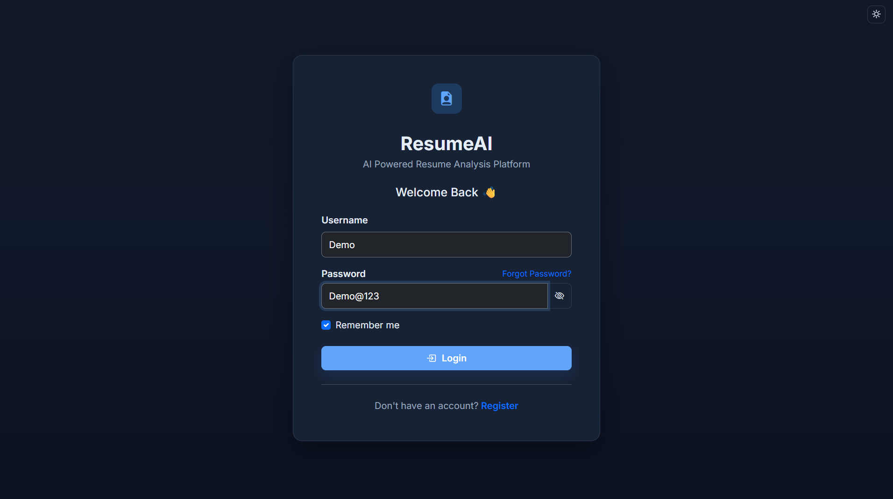
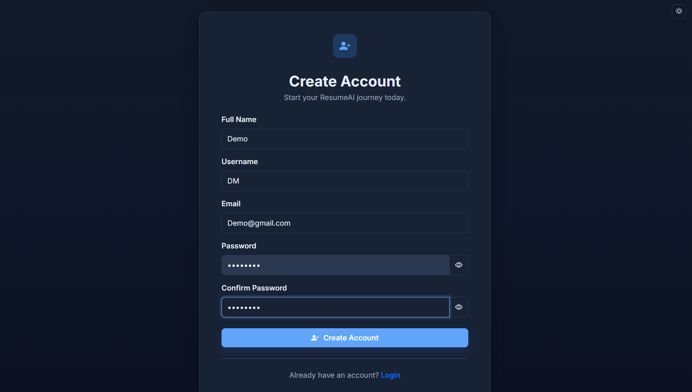
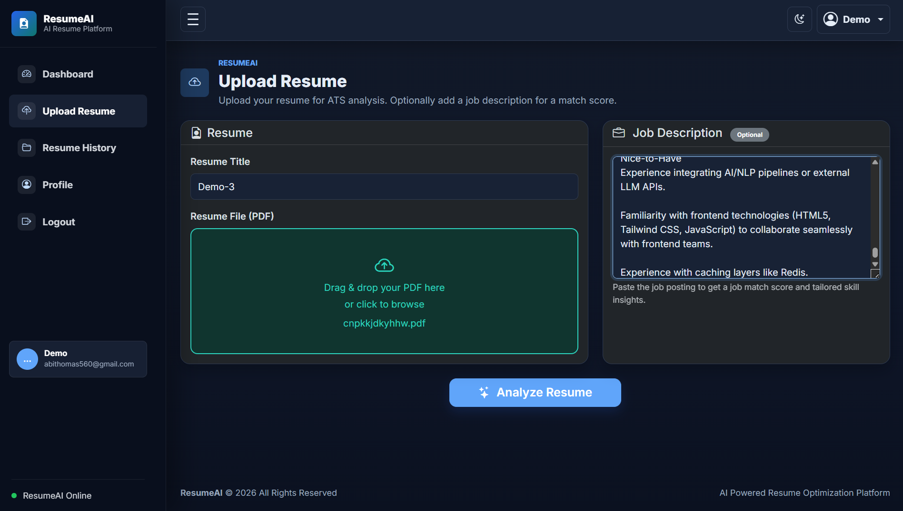
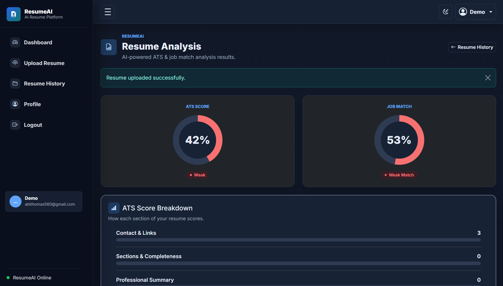
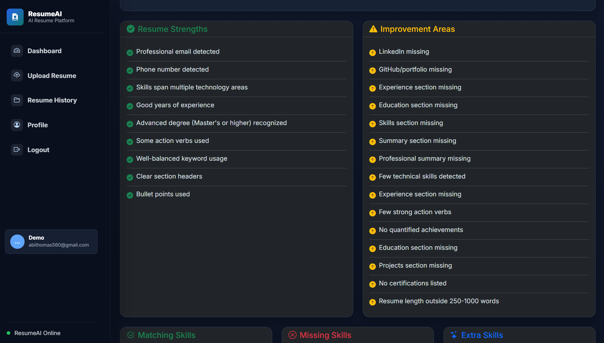
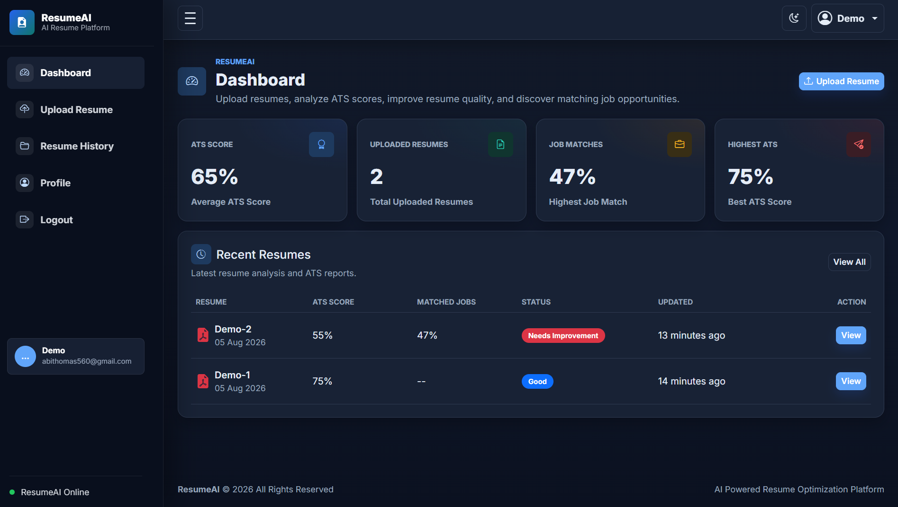
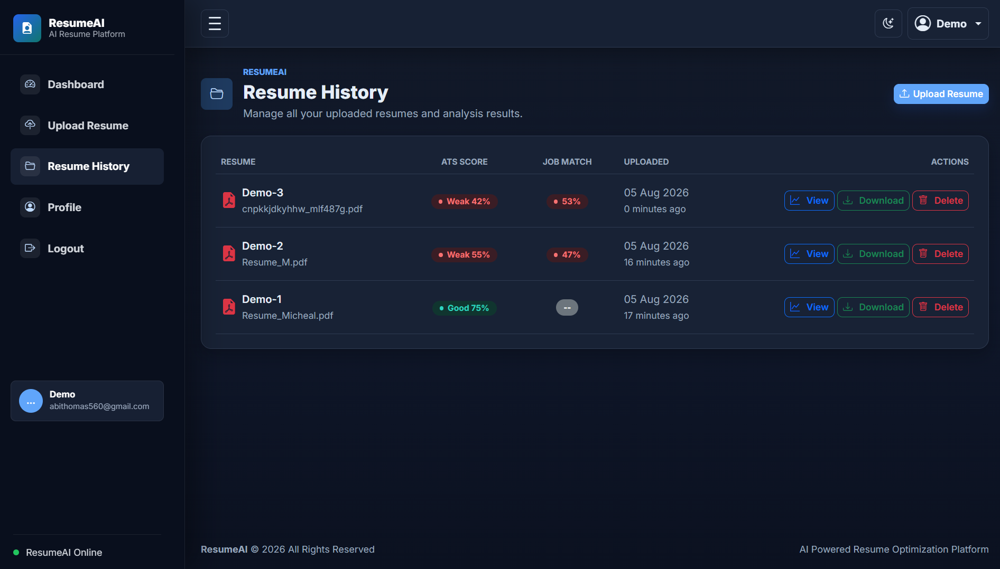
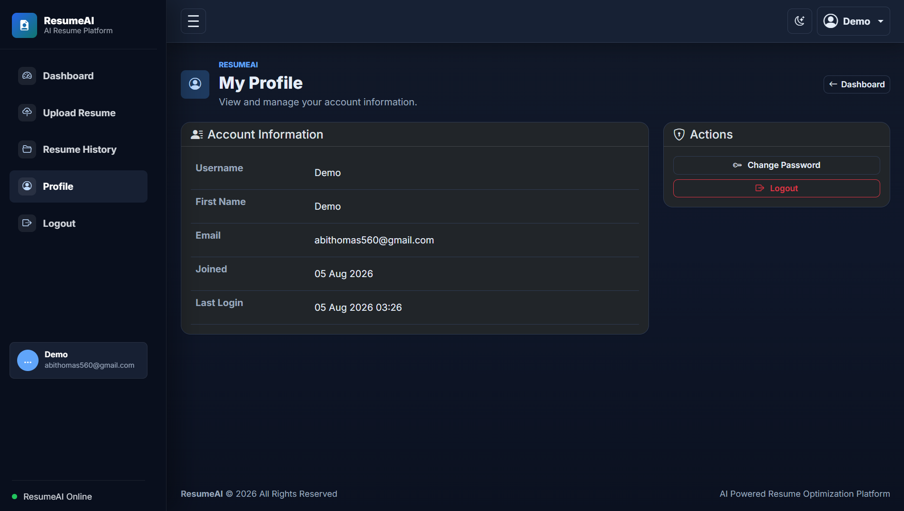

<div align="center">

# 📄 ResumeAI

### Intelligent Resume Analysis & ATS Optimization Platform

Upload a PDF resume, optionally paste a target job description, and get an
**instant, honest breakdown of ATS compatibility** — scored by a weighted
rubric, matched against the role, and explained with prioritized,
actionable recommendations.

A production-grade full-stack Django application with secure authentication,
PDF parsing, spaCy-powered NLP, persistent analysis history, a single-pass
caching pipeline, and a premium dark-theme SaaS interface.

---


</div>

---

## 📖 Project Overview

ResumeAI helps job seekers build resumes that actually **pass Applicant
Tracking Systems (ATS)** — the software recruiters use to filter candidates
before a human ever reads a resume.

The analysis engine is not a keyword counter. It **parses the resume into a
structured document** (sections, canonical skills, entities, quality features),
then evaluates it against a **weighted 100-point rubric** and a **weighted
job-match composite**. Aliases and abbreviations are resolved before any
comparison — so `JS` in a resume matches `JavaScript` in a job description,
and `ML` matches `Machine Learning`.

What you get for every resume:

- ✅ **ATS compatibility score** — 0–100 with a grade band, broken down across 10 weighted categories
- ✅ **Resume strengths & improvement areas** — prioritized, specific feedback
- ✅ **Job-match percentage** — how well the resume lines up with a pasted job posting, with matching / missing / extra skills
- ✅ **Missing-experience insights** — e.g. *"The job asks for 5+ years of Django; your resume shows ~2."*
- ✅ **Persistent history** — every analysis is saved and cached, so revisiting a resume is instant

Built with a clean **backend-first architecture**: a thin view layer, a service
layer that owns the pipeline, and a caching layer that makes re-analysis free.

---

## ✨ Key Features

| Area | Capabilities |
|------|--------------|
| **👤 Accounts** | Secure registration & login, profile management, password reset via email, session handling, Django auth hardening |
| **📄 Resumes** | PDF upload with drag & drop, persistent storage, history with **View / Download / Delete**, storage-safe deletion |
| **🤖 ATS Analysis** | Weighted 100-point rubric across 10 categories, grade bands, per-category breakdown, strengths & improvement areas |
| **💼 Job Matching** | Weighted composite (skills · experience · education · certifications · title · domain), matching/missing/extra skills, missing-experience detection |
| **🔍 NLP Intelligence** | spaCy lemmatization, canonical skill aliasing (`JS` ≡ `JavaScript`), section segmentation, degree/certification/title extraction |
| **⚡ Performance** | Single-pass parsing, `resume_json` cache (no re-parse on reload), lazy-loaded spaCy, optimized dashboard queries |
| **🎨 UX** | Light/dark theme toggle, responsive design, accessibility, premium SaaS styling across every page |

---

## 🎬 Demo

Click play for a walkthrough of the landing page:

<div align="center">

<video src="screenshots/home-demo.mp4" controls width="90%"></video>
<br>
<em>▶ Landing page demo — `screenshots/home-demo.mp4`</em>

</div>

---

## 📸 Screenshots

### 🔐 Authentication

<p align="center">
  
  
  <br>
  <em>Login & registration — dark-theme auth cards with password visibility toggles</em>
</p>

### 📤 Upload Resume

Paste a job description (optional) alongside your resume — the ATS score is
blended with job relevance when one is provided.

<p align="center">
  
  <br>
  <em>Drag-and-drop PDF upload with optional job-description matching</em>
</p>

### 🤖 Analysis Results

The analysis page shows two score rings — **ATS Score** and **Job Match** — with
grade labels and a per-category breakdown of the weighted rubric.

<p align="center">
  
  <br>
  <em>ATS & job-match score rings with category-level breakdown bars</em>
</p>

### 🧠 Strengths & Insights

Scrolling down the same page reveals categorized strengths and improvement
areas, plus matching / missing / extra skills.

<p align="center">
  
  <br>
  <em>Categorized feedback lists and skill-level match detail</em>
</p>

### 📊 Dashboard & History

<p align="center">
  
  <br>
  <em>Metric cards (avg ATS, resume count, best match) + recent resumes with tiered score badges</em>
</p>

<p align="center">
  
  
  <br>
  <em>Resume history with colored ATS badges & quick actions · Profile with account info and security actions</em>
</p>

---

## 🛠️ Technology Stack

| Category | Technology |
|----------|------------|
| **Backend** | Python 3.12, Django 5.2 |
| **Frontend** | HTML5, CSS3 (custom design system), Bootstrap 5, JavaScript |
| **Database** | SQLite (development) · PostgreSQL via `DATABASE_URL` (production) |
| **PDF Parsing** | pdfplumber 0.11 — text extraction, scanned-PDF detection |
| **NLP** | spaCy 3.8 + `en_core_web_sm` — lemmatization, NER, canonical skill matching (graceful fallback without the model) |
| **Auth** | Django built-in authentication + hardened password validators |
| **Storage** | Local filesystem (dev) · Cloudinary (production) |
| **Static Assets** | WhiteNoise (compressed manifest storage) |
| **Server** | Gunicorn (production) |
| **Config** | python-decouple + `.env` |
| **Deployment** | Render |

---

## 🏗️ System Architecture

```text
                     User Browser
                           │
                           ▼
                 Bootstrap 5 · Design System UI
                           │
                           ▼
                Django URL Routing (ResumeAI/urls.py)
                           │
                           ▼
                Django Views (thin) · services.py
                           │
                           ▼
               PDF bytes ──► parse_pdf ──► text
                           │
                           ▼
              analyzer.analyze ──► ResumeDocument
                  (sections · skills · entities · features)
                           │
        ┌──────────────────┼──────────────────┐
        ▼                  ▼                  ▼
  ats_engine           job_matcher       resume statistics
  weighted rubric      weighted          (dashboard)
  (100 pts)            composite
                           │
                           ▼
              resume_json cache + Database
              (SQLite / PostgreSQL)
                           │
                           ▼
                  Analysis Reports & History
```

**Single-pass extraction:** the PDF is parsed once into a `ResumeDocument`
dataclass; the ATS scorer, the job matcher, and the dashboard all consume that
same object. No stage re-parses or re-scans the raw text.

> 📖 For a deep dive into the pipeline, caching, and module responsibilities see
> **[docs/BACKEND_ARCHITECTURE.md](docs/BACKEND_ARCHITECTURE.md)**.

---

## 📂 Project Structure

```text
ResumeAI/
│
├── account_manager/        # User authentication & account management
├── core/                   # Landing page & core configuration
├── dashboard/              # User dashboard views (optimized queries)
├── resume/                 # Upload, analysis, ATS scoring & job matching
│   ├── views.py            # Thin views (upload, history, analyze, delete)
│   ├── services.py         # Service layer: pipeline + resume_json cache
│   ├── analyzer.py         # ResumeDocument orchestrator (single-pass)
│   ├── text_extractor.py   # PDF → text (pdfplumber, scanned-PDF flag)
│   ├── ats_engine.py       # Weighted ATS rubric (10 categories, 100 pts)
│   ├── job_matcher.py      # Weighted job-match composite (100 pts)
│   ├── skills.py           # Canonical skill taxonomy + category weights
│   ├── nlp/                # Canonicalization, sections, entities, features
│   └── tests.py            # Unit + integration suite
├── ResumeAI/               # Project settings & URL routing
├── docs/                   # Backend architecture reference
├── templates/              # Shared HTML templates (base, auth, errors)
│   ├── components/         # Sidebar, navbar, footer
│   ├── account/            # Login, register, profile, password reset
│   ├── resume/             # Upload, analysis, history
│   ├── dashboard/          # Dashboard page
│   ├── core/               # Landing page
│   └── registration/       # Password-reset email templates
├── static/                 # CSS, JavaScript, Bootstrap & icons
│   ├── css/style.css       # Design system (CSS variables, light/dark)
│   ├── js/main.js          # Sidebar, theme, password & drag-drop handlers
│   └── images/favicon/     # Favicon assets
├── media/                  # Uploaded resumes (dev storage)
├── screenshots/            # README screenshots & demo video
│
├── manage.py
├── requirements.txt
├── .env.example
└── README.md
```

---

## ⚙️ Installation & Setup

> ⚙️ **Python 3.12 is required.** The spaCy 3.8 ecosystem (including the
> `en_core_web_sm` model) does not yet support Python 3.13.

### 1️⃣ Clone the Repository

```bash
git clone https://github.com/Aby020/ResumeAI.git
cd ResumeAI
```

### 2️⃣ Create a Virtual Environment

**Windows**
```bash
python -m venv venv
venv\Scripts\activate
```

**Linux / macOS**
```bash
python3 -m venv venv
source venv/bin/activate
```

### 3️⃣ Install Dependencies

```bash
pip install -r requirements.txt
```

### 4️⃣ Install the spaCy English Model (recommended)

The analyzer works without it (plain-token fallback), but installing the model
unlocks lemmatization and entity recognition for higher-quality scoring:

```bash
python -m spacy download en_core_web_sm
```

### 5️⃣ Configure Environment Variables

Copy `.env.example` to `.env` and fill in your values:

```bash
cp .env.example .env   # Windows: copy .env.example .env
```

See the [Environment Variables](#-environment-variables) section below for the
full reference.

### 6️⃣ Apply Database Migrations

```bash
python manage.py migrate
```

### 7️⃣ Create an Administrator Account

```bash
python manage.py createsuperuser
```

### 8️⃣ Run the Development Server

```bash
python manage.py runserver
```

Then open:

- **App:** <http://127.0.0.1:8000/>
- **Admin panel:** <http://127.0.0.1:8000/admin/>

### 9️⃣ Run the Tests

```bash
python manage.py test
```

---

## 🔑 Environment Variables

| Variable | Required | Description |
|----------|----------|-------------|
| `SECRET_KEY` | ✅ | Django secret key. Generate with `python -c "from django.core.management.utils import get_random_secret_key; print(get_random_secret_key())"`. |
| `DEBUG` | — | `True` for development, `False` in production. |
| `ALLOWED_HOSTS` | — | Comma-separated hostnames, e.g. `127.0.0.1,localhost`. |
| `CSRF_TRUSTED_ORIGINS` | — | HTTPS origins allowed to POST (production only), comma-separated. Empty in dev. |
| `EMAIL_HOST_USER` | — | Gmail address for password-reset emails. App runs without it. |
| `EMAIL_HOST_PASSWORD` | — | Gmail App Password for the address above. |
| `EMAIL_HOST` | — | Defaults to `smtp.gmail.com`. |
| `EMAIL_PORT` / `EMAIL_USE_TLS` | — | Defaults to `587` / `True`. |
| `DATABASE_URL` | — | Optional. Postgres URL (e.g. on Render). Falls back to local SQLite. |
| `CLOUDINARY_CLOUD_NAME` | — | Required on Render for media storage. |
| `CLOUDINARY_API_KEY` | — | Required on Render for media storage. |
| `CLOUDINARY_API_SECRET` | — | Required on Render for media storage. |

> 💡 For `EMAIL_HOST_PASSWORD`, use a [Gmail App Password](https://support.google.com/accounts/answer/185833) (not your normal account password) when 2-Step Verification is enabled.

---

## 🚀 Usage

1. **Create an account** and log in.
2. **Upload a resume** — give it a title, drop your PDF, and optionally paste a
   target **job description**.
3. **Review the analysis** — the ATS score ring, the per-category breakdown,
   strengths, improvement areas, and (when a job description was provided) the
   job-match percentage with matching / missing / extra skills.
4. **Act on the feedback** — recommendations are prioritized and specific
   (e.g. *"Add a professional summary of 40–120 words"* or *"Quantify 2–3
   achievements with numbers, percentages, or dollar figures"*).
5. **Revisit any time** — every analysis is cached in `resume_json`; reloading
   an existing resume re-renders instantly without re-parsing the PDF.

### Understanding the grade bands

| ATS Score | Grade | Meaning |
|-----------|-------|---------|
| 90–100 | 🏆 **Excellent** | Highly competitive resume |
| 75–89 | ✅ **Good** | Solid resume, minor improvements |
| 60–74 | ⚠️ **Moderate** | Some areas need attention |
| 40–59 | 🔴 **Weak** | Significant gaps in ATS fundamentals |
| < 40 | ❌ **Poor** | Likely filtered out by ATS |

---

## 🤖 ATS Engine

`resume/ats_engine.py` evaluates **content, not keyword presence** — a resume
that merely contains the words "experience" or "education" earns nothing.
The rubric sums to **100 points** across 10 weighted categories:

| Category | Weight | What earns points |
|---|---|---|
| Contact & Links | 5 | email, phone, LinkedIn, GitHub/portfolio — **partial credit per item** |
| Sections & Completeness | 10 | which standard sections are present, weighted |
| Professional Summary | 5 | present + 40–120 words + quality signals |
| Skills Relevance | 25 | canonical count (log-scaled), tech-vs-soft weighting, synonym-aware; blended with JD relevance when a JD is given |
| Experience Quality | 20 | section + quantified years + action verbs + quantified achievements + titles/companies detected |
| Education | 10 | section + degree level + field of study |
| Projects & Certifications | 10 | projects with tech used + recognized certifications |
| Action Verbs & Language | 5 | strong-action-verb ratio in experience/project lines |
| Keyword Density & Context | 5 | **balanced** density; repetition ratio `(mentions − unique) / unique` — stuffing is penalized |
| Formatting & Structure | 5 | section headers, bullets, consistent dates, 250–1000 words |
| **Total** | **100** | |

**Calibration (verified by tests):** an empty/garbage resume scores **< 25**; a
keyword-dump scores **~8** (previously ~72 — it is now penalized for stuffing);
a genuine strong resume scores **80+**.

---

## 💼 Job Matching Engine

`resume/job_matcher.py` produces a **weighted composite** rather than a raw
set-ratio — so the score is **stable regardless of job-description length**.
The job description is parsed into required/preferred skills, years,
degrees, certifications, and a role title; the resume's canonical skills and
extracted entities are compared across six dimensions:

| Dimension | Weight | Evaluates |
|---|---|---|
| Skills | 45 | canonical overlap — **required skills weighted over preferred** |
| Experience | 20 | JD-required years vs. resume years |
| Education | 10 | JD degree requirement vs. highest resume degree |
| Certifications | 5 | JD-listed certs vs. resume certs |
| Title | 5 | JD role vs. resume job titles (lemmatized token similarity) |
| Domain | 15 | responsibility/industry keyword coverage |
| **Total** | **100** | |

**Canonicalization happens before any comparison.** An alias graph collapses
equivalent spellings first, so:

```
JS      ≡ JavaScript        React.js ≡ React
NodeJS  ≡ Node.js           Python3  ≡ Python
ML      ≡ Machine Learning  AI       ≡ Artificial Intelligence
C++     ≡ cpp               K8s      ≡ Kubernetes
AWS S3  ≡ S3                ...
```

The result surfaces **missing required skills**, **missing experience** (e.g.
*"JD asks for 5+ yrs of Django; resume shows ~2"*), and prioritized suggestions.

---

## 🔬 Resume Parsing Pipeline

`resume/text_extractor.py` → `resume/analyzer.py` → **`ResumeDocument`**.

| Stage | Module | Responsibility |
|---|---|---|
| Extract | `text_extractor.py` | PDF → text via pdfplumber; sets a **scanned-PDF flag** when no text layer exists |
| Segment | `nlp/sections.py` | Split the text into labeled sections (summary, skills, experience, education, projects, certifications, languages, awards, …) |
| Canonicalize | `nlp/aliases.py` + `skills.py` | Resolve aliases (`JS` → `JavaScript`) and assign skill categories **before any comparison** |
| Extract entities | `nlp/entities.py` | Degrees, certifications, job titles, companies, and **years of experience** |
| Measure quality | `nlp/features.py` | Action verbs, bullet counts, quantified achievements, date-range consistency |
| Normalize | `nlp/normalize.py` | Tokenization, contact redaction, spaCy lemmatization with a **plain-token fallback** |
| Orchestrate | `analyzer.py` | Assemble every signal into one `ResumeDocument` consumed by ATS + job match |

The spaCy model is **lazy-loaded and cached** per process; if the model is
absent, the pipeline degrades gracefully to plain tokenization instead of
crashing.

---

## 🔒 Security Features

| Layer | What's implemented |
|---|---|
| **Auth** | Django built-in authentication; every resume view requires login (`@login_required`) |
| **Passwords** | Django's hardened validators: min length 8, similarity check, common & numeric-password rejection |
| **CSRF** | CSRF middleware on all POST routes, with `CSRF_TRUSTED_ORIGINS` support for HTTPS hosts |
| **XSS** | Django template auto-escaping everywhere |
| **Clickjacking** | `XFrameOptionsMiddleware` (deny framing) |
| **Headers** | `SecurityMiddleware` in the middleware chain |
| **Secrets** | All credentials live in `.env` (gitignored) via python-decouple; a template ships as `.env.example` |
| **File uploads** | PDF uploads restricted via `accept=".pdf"`; job images to `.png/.jpg/.jpeg` |
| **Privacy** | `nlp/normalize.py` **redacts emails, URLs, and phone numbers** into placeholders before analysis |
| **Storage-safe deletion** | Files removed via the storage API (works identically for local disk and Cloudinary) |

---

## ⚡ Performance Optimizations

| Optimization | What it does |
|---|---|
| **Single-pass extraction** | The PDF is parsed **once** into a `ResumeDocument`; ATS scoring and job matching share the same object — no re-scanning |
| **`resume_json` cache** | The full analysis payload is stored on `ResumeAnalysis`; the cache key is `sha1(pdf bytes + job description)`. Reloading an analysis short-circuits with **no re-parse, no re-score** |
| **Lazy spaCy** | The model loads once per process and is reused across requests; NER is disabled for the lemmatization pass |
| **Compiled regexes** | Pattern objects are compiled once at module load, not per call |
| **Optimized dashboard** | `select_related("analysis")` + a single `aggregate()` — ≤ 6 queries (verified by test) |
| **Persistent connections** | `conn_max_age=600` for database connections |

---

## 📖 Backend Documentation

For a deep dive into the analysis pipeline — resume parsing, canonical skill
matching, the weighted ATS rubric, the job-match composite, the service layer,
and the `resume_json` cache — see
**[docs/BACKEND_ARCHITECTURE.md](docs/BACKEND_ARCHITECTURE.md)**.

---

## 🗺️ Roadmap

- 🤖 AI-powered resume suggestions & generation
- 🎯 Advanced ATS optimization & keyword targeting
- 📄 OCR support for scanned resumes
- 🌐 Multi-language resume analysis
- 💬 AI career assistant & mock interview prep
- 🐳 Docker deployment & ☁️ cloud storage options
- 📱 Progressive Web App (PWA) support
- 🔗 LinkedIn profile import

---

## 🚀 Deployment (Render)

The project is production-ready for [Render](https://render.com):

1. Create a **Web Service** pointed at your GitHub repo.
2. **Build command:** `pip install -r requirements.txt && python manage.py migrate && python manage.py collectstatic --noinput`
3. **Start command:** `gunicorn ResumeAI.wsgi`
4. **Environment:** set `SECRET_KEY`, `DEBUG=False`, `ALLOWED_HOSTS`, `DATABASE_URL` (Postgres), `EMAIL_*`, and the `CLOUDINARY_*` keys. Set the `RENDER` environment variable to `True` to activate Cloudinary media storage.

> ⚠️ The custom 404/500 error pages render automatically in production (Django uses them when `DEBUG=False`).

---

## 📄 License

This project is licensed under the **MIT License**. See the [LICENSE](LICENSE) file for details.

---

## 👨‍💻 Author

<div align="center">

### Abi Thomas

**Backend Developer | Python & Django Developer**

Passionate about building intelligent web applications, scalable backend systems, AI-powered platforms, and production-ready software using Python, Django, PostgreSQL, REST APIs, and modern web technologies.

<p>

<a href="https://github.com/Aby020">

</a>

<a href="https://linkedin.com/in/abithomas-dev">

</a>

</p>

</div>

---

## ⭐ Support

If you found this project helpful, please consider giving it a ⭐ on GitHub. Your support motivates continued development of production-quality, open-source software.

For suggestions, feature requests, or collaboration, feel free to connect on [GitHub](https://github.com/Aby020) or [LinkedIn](https://linkedin.com/in/abithomas-dev).
