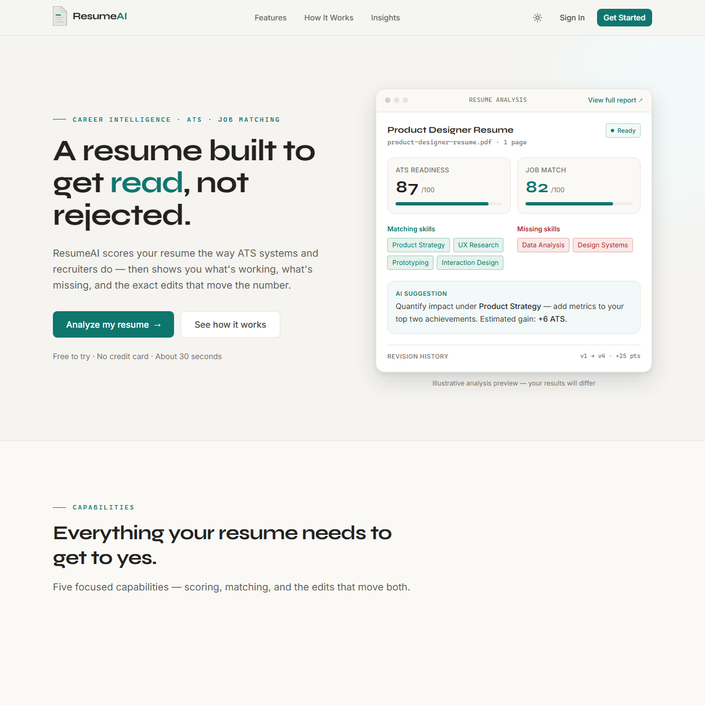

<div align="center">

# 📄 ResumeAI

### Intelligent Resume Analysis & ATS Optimization Platform

Upload a PDF resume, optionally paste a target job description, and get an
**instant, honest breakdown of ATS compatibility** — scored by a weighted
rubric, matched against the role, and explained with prioritized,
actionable recommendations.

---


</div>

---

## 📖 Project Overview

ResumeAI helps job seekers build resumes that actually **pass Applicant
Tracking Systems (ATS)** — the software recruiters use to filter candidates
before a human ever reads a resume.

The analysis engine is not a keyword counter. It **parses the resume into a
structured document** (sections, canonical skills, entities, quality features),
then evaluates it against a **weighted 100-point rubric** and a **weighted
job-match composite**. Aliases and abbreviations are resolved before any
comparison — so `JS` in a resume matches `JavaScript` in a job description,
and `ML` matches `Machine Learning`.

What you get for every resume:

- ✅ **ATS compatibility score** — 0–100 with a grade band, broken down across 10 weighted categories
- ✅ **Resume strengths & improvement areas** — prioritized, specific feedback
- ✅ **Job-match percentage** — how well the resume lines up with a pasted job posting, with matching / missing / extra skills
- ✅ **AI-powered explanations** — plain-language breakdowns of ATS gaps and job-match weaknesses, grounded in deterministic engine findings
- ✅ **AI rewrite suggestions** — concrete, ready-to-use rewrites for specific resume sections
- ✅ **Persistent history** — every analysis is saved and cached, so revisiting a resume is instant

---

## 🔴 Live Demo

| Service | URL |
|---------|-----|
| **Frontend** | [resumeai-frontend-nguv.onrender.com](https://resumeai-frontend-nguv.onrender.com) |
| **Backend API** | [resumeai-backend-8rza.onrender.com](https://resumeai-backend-8rza.onrender.com) |

> Create an account to try the full analysis pipeline — upload a PDF, optionally
> paste a job description, and get an instant ATS score with AI-powered insights.

---

## 📸 Screenshots

| | |
|:---:|:---:|
|  |  |
| *Landing page — hero + product preview* | *Dashboard — scores, analyses, actions* |
|  |  |
| *Upload — drag-and-drop PDF + job description* | *Analysis — ATS 92/100, Job Match 89/100* |
|  |  |
| *History — version progression + searchable list* | *Profile — settings, account, preferences* |

---

## 🔄 Core Workflow

```text
1. Sign up / Sign in ──────── JWT auth (access + refresh tokens)
         │
2. Upload PDF ─────────────── pdfplumber extracts text (pdfplumber 0.11)
         │
3. Paste JD (optional) ────── Job description for targeted matching
         │
4. Analysis Pipeline ──────── Single-pass extraction → structured document
         │
    ┌────┴────────────────────┐
    │                         │
    ▼                         ▼
ATS Scoring              Job Matching
(100-pt rubric,          (weighted composite:
 10 categories)           skills · experience ·
    │                     education · certs ·
    ▼                     title · domain)
    │                         │
    └────────┬────────────────┘
             │
             ▼
   AI Explanation + Rewrite
   (OpenAI gpt-4o-mini,
    grounded in engine output)
             │
             ▼
   Persistent Result
   (resume_json + DB cache)
```

---

## ✨ Key Features

| Area | Capabilities |
|------|--------------|
| **👤 Accounts** | Secure registration & login, profile management, JWT auth (15-min access / 7-day refresh), protected routes |
| **📄 Resumes** | PDF upload with drag & drop, persistent storage, version history with search/sort/filter |
| **🤖 ATS Analysis** | Weighted 100-point rubric across 10 categories, grade bands, per-category breakdown, strengths & improvement areas |
| **💼 Job Matching** | Weighted composite across 6 dimensions, matching/missing/extra skills, missing-experience detection |
| **🧠 AI Insights** | OpenAI-powered plain-language explanations grounded in deterministic engine findings, prioritized recommendations |
| **✍️ AI Rewrites** | Concrete, ready-to-use resume section rewrites with before/after views and rationale |
| **⚡ Performance** | Single-pass extraction, `resume_json` caching, lazy-loaded NLP, optimized dashboard queries |
| **🎨 UI** | Light/dark theme toggle, responsive design, Motion animations, Tailwind CSS v4 design system |

---

## 🤖 ATS Engine

The rubric sums to **100 points** across 10 weighted categories:

| Category | Weight | What earns points |
|---|---|---|
| Contact & Links | 5 | email, phone, LinkedIn, GitHub/portfolio — **partial credit per item** |
| Sections & Completeness | 10 | which standard sections are present, weighted |
| Professional Summary | 5 | present + 40–120 words + quality signals |
| Skills Relevance | 25 | canonical count (log-scaled), tech-vs-soft weighting, synonym-aware; blended with JD relevance when a JD is given |
| Experience Quality | 20 | section + quantified years + action verbs + quantified achievements + titles/companies detected |
| Education | 10 | section + degree level + field of study |
| Projects & Certifications | 10 | projects with tech used + recognized certifications |
| Action Verbs & Language | 5 | strong-action-verb ratio in experience/project lines |
| Keyword Density & Context | 5 | **balanced** density; repetition ratio `(mentions − unique) / unique` — stuffing is penalized |
| Formatting & Structure | 5 | section headers, bullets, consistent dates, 250–1000 words |
| **Total** | **100** | |

**Grade bands:**

| Score | Grade | Meaning |
|-------|-------|---------|
| 90–100 | 🏆 **Excellent** | Highly competitive resume |
| 75–89 | ✅ **Good** | Solid resume, minor improvements |
| 60–74 | ⚠️ **Moderate** | Some areas need attention |
| 40–59 | 🔴 **Weak** | Significant gaps in ATS fundamentals |
| < 40 | ❌ **Poor** | Likely filtered out by ATS |

---

## 💼 Job Matching Engine

The job-match score is a **weighted composite** rather than a raw set-ratio, so
the score is **stable regardless of job-description length**.

| Dimension | Weight | Evaluates |
|---|---|---|
| Skills | 45 | canonical overlap — **required skills weighted over preferred** |
| Experience | 20 | JD-required years vs. resume years |
| Education | 10 | JD degree requirement vs. highest resume degree |
| Certifications | 5 | JD-listed certs vs. resume certs |
| Title | 5 | JD role vs. resume job titles (lemmatized token similarity) |
| Domain | 15 | responsibility/industry keyword coverage |
| **Total** | **100** | |

**Canonicalization happens before any comparison.** An alias graph collapses
equivalent spellings first, so:

```
JS      ≡ JavaScript        React.js ≡ React
NodeJS  ≡ Node.js           Python3  ≡ Python
ML      ≡ Machine Learning  AI       ≡ Artificial Intelligence
C++     ≡ cpp               K8s      ≡ Kubernetes
AWS S3  ≡ S3                ...
```

---

## 🧠 AI-Powered Insights

ResumeAI includes an **AI layer** that builds on the deterministic ATS and
job-match engines to generate **grounded, actionable explanations and rewrites**.

### AI Explanation

- **Plain-language breakdown** of ATS scores and job-match gaps
- **Prioritized items** (high / medium / low) tied to specific engine findings
- **Executive summary** (2–3 sentences) of the resume's fit for the target role
- Every finding is **grounded** — it must match a verbatim finding from the
  deterministic ATS or job-match payload

### AI Rewrite Suggestions

- **Concrete, ready-to-use rewrites** for specific resume sections (Professional
  Summary, Skills, Work Experience, etc.)
- **Before/after view** with the original text quoted from the resume
- Each rewrite targets a **specific engine finding** with a rationale

### Graceful Degradation

| Scenario | Behavior |
|----------|----------|
| No `OPENAI_API_KEY` | AI sections hidden; deterministic recommendations shown |
| Rate limit / timeout / network error | Cached result served if available; otherwise AI sections hidden gracefully |
| Invalid model response | Retried once with stricter grounding reminder; falls back to deterministic output |
| `DEBUG=True` + API failure | Mock grounded data returned (for UI verification without quota) |

The AI layer **never** recalculates ATS scores or re-parses the PDF. It only
explains and rewrites using deterministic engine outputs as ground truth.

---

## 🔐 Auth & Security

| Layer | Implementation |
|-------|----------------|
| **Authentication** | JWT via `djangorestframework-simplejwt` — 15-min access tokens, 7-day refresh tokens |
| **Endpoints** | `/api/auth/login/`, `/api/auth/register/`, `/api/auth/me/`, `/api/auth/logout/`, `/api/auth/token/refresh/` |
| **Route protection** | React `ProtectedRoute` — unauthenticated visitors redirected to `/sign-in` with `from` state for post-login return |
| **Token storage** | `localStorage` keys `resumeAI.access_token` / `resumeAI.refresh_token` |
| **API requests** | Custom `apiFetch` utility with single 401-retry + in-flight refresh guard |
| **Passwords** | Django's hardened validators: min length 8, similarity check, common & numeric-password rejection |
| **CSRF** | `django-cors-headers` with `CORS_ALLOWED_ORIGINS` for cross-origin frontend |
| **File uploads** | PDF-only enforced at upload; analysis runs server-side |
| **Privacy** | NLP normalizer redacts emails, URLs, and phone numbers into placeholders before analysis |

---

## 🛠️ Technology Stack

### Frontend

| Category | Technology |
|----------|------------|
| **Framework** | React 19 + TypeScript 6 (strict) |
| **Build** | Vite 8 |
| **Styling** | Tailwind CSS v4 + `@tailwindcss/vite` plugin |
| **Routing** | React Router v7 |
| **Animations** | Motion (Framer Motion successor) |
| **Linting** | oxlint |

### Backend

| Category | Technology |
|----------|------------|
| **Framework** | Django 5.2 + Django REST Framework |
| **Auth** | JWT via `djangorestframework-simplejwt` |
| **PDF Parsing** | pdfplumber 0.11 |
| **NLP** | spaCy 3.8 + `en_core_web_sm` (enhances scoring; graceful fallback without model) |
| **AI** | OpenAI API (gpt-4o-mini) — explanations + rewrite suggestions |
| **Database** | SQLite (local) · PostgreSQL via Neon (production, `dj-database-url`) |
| **Media Storage** | Local filesystem (dev) · Cloudinary (production, via `django-cloudinary-storage`) |
| **Serving** | Gunicorn (production) + WhiteNoise (static files) |
| **Config** | `python-decouple` + `.env` |

### Infrastructure

| Category | Details |
|----------|---------|
| **Frontend deploy** | Render Static Site — `npm run build` with `VITE_API_URL` baked in at build time |
| **Backend deploy** | Render Web Service — Python 3.12, Gunicorn |
| **Database** | Neon PostgreSQL (managed, free tier) |
| **Media CDN** | Cloudinary |
| **CI** | GitHub Actions |

---

## 📂 Project Structure

```text
ResumeAI/
│
├── frontend/                     # React SPA (Vite + TypeScript + Tailwind)
│   ├── src/
│   │   ├── components/
│   │   │   ├── layout/           # PageShell (app shell for authenticated pages)
│   │   │   ├── shared/           # Container, Card, Alert, Skeleton, etc.
│   │   │   ├── ui/               # Button, Panel, ScoreBar, ThemeToggle, ConfirmDialog
│   │   │   └── workspace/        # WorkspaceNav (authenticated top nav)
│   │   ├── contexts/             # AuthContext, ThemeContext
│   │   ├── hooks/                # useLocalStorage, useReducedMotion, useDocumentTitle, useCountUp
│   │   ├── pages/
│   │   │   ├── landing/          # LandingPage (public)
│   │   │   ├── auth/             # SignInPage, SignUpPage
│   │   │   ├── dashboard/        # DashboardPage
│   │   │   ├── upload/           # UploadPage
│   │   │   ├── analysis/         # AnalysisPage
│   │   │   ├── history/          # HistoryPage
│   │   │   └── profile/          # ProfilePage
│   │   ├── routes/               # AppRoutes, ProtectedRoute
│   │   ├── types/                # TypeScript models + API error types
│   │   └── lib/                  # apiFetch (JWT-aware wrapper), constants
│   ├── vite.config.ts            # Vite config with /api proxy to Django
│   └── package.json
│
├── account_manager/              # Registration, login, profile API (DRF + JWT)
├── dashboard/                    # Dashboard aggregation API
├── core/                         # Root URL routing
├── resume/                       # Analysis pipeline + CRUD
│   ├── api_views.py              # DRF viewsets (upload, list, detail, analysis)
│   ├── services.py               # Pipeline orchestration + resume_json caching
│   ├── analyzer.py               # ResumeDocument orchestrator (single-pass extraction)
│   ├── ats_engine.py             # Weighted ATS rubric (10 categories, 100 pts)
│   ├── job_matcher.py            # Weighted job-match composite (6 dimensions, 100 pts)
│   ├── skills.py                 # Canonical skill taxonomy + category weights
│   ├── text_extractor.py         # PDF → text via pdfplumber
│   ├── models.py                 # ResumeAnalysis (resume_json, AI fields)
│   ├── serializers.py            # DRF serializers (pulls from resume_json)
│   ├── nlp/                      # NLP sub-package
│   │   ├── sections.py           # Section segmentation
│   │   ├── aliases.py            # Canonical skill aliasing (JS ≡ JavaScript)
│   │   ├── entities.py           # Degrees, certs, titles, companies, years
│   │   ├── features.py           # Action verbs, bullets, quantified achievements
│   │   ├── normalize.py          # Tokenization, contact redaction, spaCy lemmatization
│   │   └── skill_extractor.py    # Skill extraction from text
│   └── ai/                       # AI sub-package
│       ├── service.py            # Orchestration: prompt → OpenAI → validate → cache
│       ├── client.py             # Thin OpenAI SDK wrapper
│       ├── prompts.py            # Prompt builders with grounding instructions
│       └── schemas.py            # Pydantic v2 models (AIExplanation, AIRewrite)
│
├── ResumeAI/                     # Django project settings & URL routing
├── static/                       # Legacy static assets (CSS, JS, Bootstrap icons)
├── templates/                    # Legacy Django HTML templates (auth, errors)
├── screenshots/                  # README screenshots (1:1 aspect ratio)
├── docs/                         # Backend architecture reference
├── browser_qa/                   # QA scripts, demo resume generator
│
├── manage.py
├── requirements.txt              # Python dependencies
├── render.yaml                   # Render deployment blueprint
├── .env.example                  # Backend environment variables template
├── README.md
└── LICENSE
```

---

## ⚙️ Local Development

### Prerequisites

- **Python 3.12**
- **Node.js 20+** (for the React frontend)

### 1. Clone the Repository

```bash
git clone https://github.com/Aby020/ResumeAI.git
cd ResumeAI
```

### 2. Backend Setup

```bash
# Create and activate a virtual environment
python -m venv venv
# Windows:
venv\Scripts\activate
# Linux/macOS:
source venv/bin/activate

# Install dependencies
pip install -r requirements.txt

# Install spaCy English model (optional — enhances scoring; works without it)
python -m spacy download en_core_web_sm

# Configure environment
cp .env.example .env
# Edit .env with your SECRET_KEY, OPENAI_API_KEY (optional), etc.

# Apply migrations
python manage.py migrate

# Create an admin account
python manage.py createsuperuser

# Start the backend
python manage.py runserver
# API available at http://127.0.0.1:8000/api/
```

### 3. Frontend Setup

```bash
cd frontend

# Install dependencies
npm install

# Start the dev server (proxies /api to Django on :8000)
npm run dev
# App available at http://localhost:5173
```

> **Note:** In development, the Vite dev server proxies `/api` requests to
> `http://127.0.0.1:8000`, so no CORS configuration is needed.

### 4. Run Tests

```bash
# Backend
python manage.py test

# Frontend lint
npm run lint
```

---

## 🚀 Production Deployment (Render)

The project uses two Render services: a **Static Site** for the React SPA and a
**Web Service** for the Django API.

### Backend (Web Service)

1. Create a **Web Service** pointed at the GitHub repo.
2. **Build command:**
   ```bash
   pip install -r requirements.txt && python manage.py migrate --noinput && python manage.py collectstatic --noinput
   ```
3. **Start command:** `gunicorn ResumeAI.wsgi:application --bind 0.0.0.0:$PORT --timeout 120`
4. **Environment variables:** set `SECRET_KEY`, `DEBUG=False`, `ALLOWED_HOSTS`, `CORS_ALLOWED_ORIGINS` (your frontend origin), `CSRF_TRUSTED_ORIGINS`, `DATABASE_URL` (Neon PostgreSQL), `CLOUDINARY_*`, and optionally `OPENAI_API_KEY`.

### Frontend (Static Site)

1. Create a **Static Site** pointed at the `frontend/` subdirectory.
2. **Build command:**
   ```bash
   npm install && npm run build
   ```
3. **Publish directory:** `dist`
4. **Environment variable:** `VITE_API_URL` = your backend API URL (e.g. `https://resumeai-backend-8rza.onrender.com/api`)

> `VITE_API_URL` is baked into the JS bundle at build time. Without it, the
> production SPA falls back to same-origin `/api`, which only works when hosted
> on the same origin as the API.

### Environment Variables

| Variable | Required | Description |
|----------|----------|-------------|
| `SECRET_KEY` | ✅ | Django secret key |
| `DEBUG` | — | `True` for development, `False` in production |
| `ALLOWED_HOSTS` | — | Comma-separated hostnames |
| `CORS_ALLOWED_ORIGINS` | — | Frontend origin(s) allowed to call the API (e.g. `https://your-frontend.onrender.com`) |
| `CSRF_TRUSTED_ORIGINS` | — | HTTPS origins allowed for CSRF (production only) |
| `DATABASE_URL` | — | PostgreSQL connection string (e.g. Neon). Falls back to local SQLite |
| `CLOUDINARY_CLOUD_NAME` | — | Required on Render for media storage |
| `CLOUDINARY_API_KEY` | — | Required on Render for media storage |
| `CLOUDINARY_API_SECRET` | — | Required on Render for media storage |
| `OPENAI_API_KEY` | — | Enables AI-powered explanations and rewrites |
| `OPENAI_MODEL` | — | Default: `gpt-4o-mini` |
| `EMAIL_HOST` | — | SMTP host (default: `smtp.gmail.com`) |
| `EMAIL_PORT` | — | SMTP port (default: `587`) |
| `EMAIL_USE_TLS` | — | Default: `True` |
| `EMAIL_HOST_USER` | — | Gmail address for password-reset emails |
| `EMAIL_HOST_PASSWORD` | — | Gmail App Password |
| `VITE_API_URL` | ✅ (frontend build) | Backend API base URL (e.g. `https://backend.onrender.com/api`) |

---

## 📚 Documentation

- **[docs/BACKEND_ARCHITECTURE.md](docs/BACKEND_ARCHITECTURE.md)** — deep dive into the analysis pipeline, caching, and module responsibilities

---

## 🗺️ Roadmap

- 🎯 Advanced ATS optimization & keyword targeting
- 📄 OCR support for scanned resumes
- 🌐 Multi-language resume analysis
- 💬 AI career assistant & mock interview prep
- 🐳 Docker deployment
- 📱 Progressive Web App (PWA) support
- 🔗 LinkedIn profile import

---

## 📄 License

This project is licensed under the **MIT License**.

---

## 👨‍💻 Author

<div align="center">

### Abi Thomas

**Backend Developer | Python & Django Developer**

Passionate about building intelligent web applications, scalable backend systems, AI-powered platforms, and production-ready software using Python, Django, PostgreSQL, REST APIs, and modern web technologies.

<p>

<a href="https://github.com/Aby020">

</a>

<a href="https://linkedin.com/in/abithomas-dev">

</a>

</p>

</div>

---

## ⭐ Support

If you found this project helpful, please consider giving it a ⭐ on GitHub. Your support motivates continued development of production-quality, open-source software.

For suggestions, feature requests, or collaboration, feel free to connect on [GitHub](https://github.com/Aby020) or [LinkedIn](https://linkedin.com/in/abithomas-dev).
