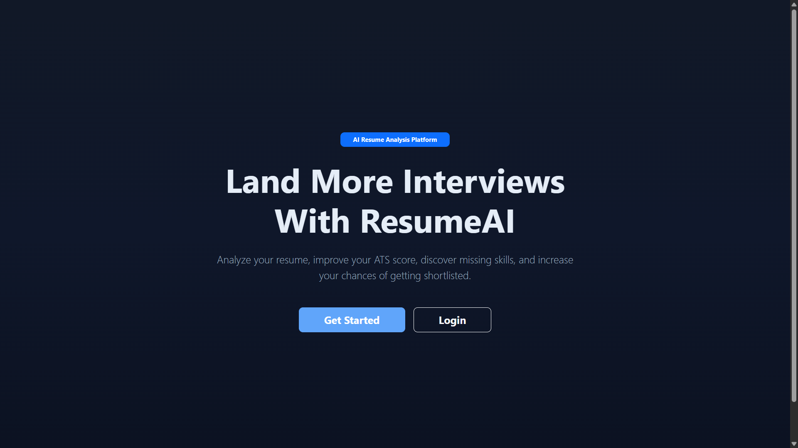

# 📄 ResumeAI

<div align="center">

### Intelligent Resume Analysis & ATS Optimization Platform

A modern full-stack Django web application that empowers job seekers to analyze resumes, calculate ATS compatibility scores, compare resumes against job descriptions, and receive actionable insights through a secure, responsive, and AI-assisted platform.


</div>

<p align="center">
  
</p>

## 📖 Project Overview

ResumeAI is a full-stack Django web application designed to help job seekers improve their resumes through intelligent resume analysis and ATS (Applicant Tracking System) optimization.

The platform enables users to securely upload resumes, compare them against job descriptions, calculate ATS compatibility scores, identify missing keywords, review resume strengths, and receive improvement suggestions through an intuitive dashboard.

Built with Django and Bootstrap, ResumeAI demonstrates practical implementation of secure authentication, file management, resume parsing, ATS scoring, keyword matching, CRUD operations, and responsive web design while providing a real-world solution for modern recruitment workflows.

Whether preparing for internships, software engineering positions, or professional career opportunities, ResumeAI helps users build stronger resumes and improve their chances of passing Applicant Tracking Systems.

## ✨ Key Features

### 👤 User Management

- Secure User Registration
- User Login & Authentication
- Profile Management
- Password Reset
- Session Management

### 📄 Resume Management

- Upload Resume (PDF)
- Resume Storage
- Resume History
- Resume Management
- Resume Preview

### 🤖 AI Resume Analysis

- ATS Compatibility Score
- Resume Strength Analysis
- Improvement Suggestions
- Keyword Analysis
- Resume Quality Evaluation
- Skill Identification

### 💼 Job Description Matching

- Upload Job Description
- Resume vs Job Comparison
- Match Percentage
- Missing Keyword Detection
- ATS Optimization Guidance

### 📊 Analytics Dashboard

- Resume Statistics
- ATS Score Visualization
- Resume History
- User Dashboard
- Analysis Reports

### 🔒 Security Features

- Django Authentication
- Protected User Dashboard
- Secure File Upload
- Session Management
- Environment Variable Configuration

### 🎨 User Experience

- Modern Responsive Interface
- Bootstrap 5 Components
- Clean Dashboard Design
- Mobile-Friendly Layout
- Simple Navigation

## 📸 Screenshots

### 🏠 Landing Page

The landing page introduces ResumeAI with an overview of the platform, highlighting ATS analysis, resume optimization, and intelligent job matching features.

<p align="center">
  
</p>

---

### 🔐 User Login

Users can securely access their accounts to manage resumes and view personalized ATS analysis.

<p align="center">
  
</p>

---

### 👤 User Registration

New users can create an account quickly and securely before accessing ResumeAI's features.

<p align="center">
  
</p>

---

### 📊 User Dashboard

The dashboard provides quick access to uploaded resumes, ATS scores, recent analyses, and profile management.

<p align="center">
  
</p>

---

### 📄 Resume Upload

Users can securely upload PDF resumes for analysis and ATS evaluation.

<p align="center">
  
</p>

---

### 🤖 Resume Analysis

ResumeAI evaluates uploaded resumes, calculates ATS compatibility scores, identifies missing keywords, and provides actionable improvement suggestions.

<p align="center">
  
</p>

---

### 📂 Resume History

Users can view previously uploaded resumes, review historical ATS scores, and revisit earlier analyses.

<p align="center">
  
</p>

---

### 👨‍💻 User Profile

The profile page allows users to manage personal information and account settings through a clean interface.

<p align="center">
  
</p>

## 🛠️ Technology Stack

| Category | Technologies |
|-----------|--------------|
| **Backend** | Python, Django 5.2 |
| **Frontend** | HTML5, CSS3, Bootstrap 5, JavaScript |
| **Database** | SQLite (Development), PostgreSQL (Production Ready) |
| **Authentication** | Django Authentication |
| **File Processing** | PDF Resume Upload & Parsing |
| **Development Tools** | VS Code, Git, GitHub |
| **Deployment** | Render |
| **Configuration** | Environment Variables (.env) |

## 📂 Project Structure

```text
ResumeAI/
│
├── account_manager/          # User authentication & account management
├── analytics/                # ATS scoring & resume analysis
├── core/                     # Core project configuration
├── dashboard/                # User dashboard
├── jobs/                     # Job description matching
├── resume/                   # Resume upload & management
├── templates/                # HTML templates
├── static/                   # CSS, JavaScript & assets
├── media/                    # Uploaded resumes
├── screenshots/              # README screenshots
│
├── manage.py
├── requirements.txt
├── README.md
└── .env
```

## 🏗️ System Architecture

```text
                     User Browser
                           │
                           ▼
                 Bootstrap 5 Interface
                           │
                           ▼
                Django URL Routing System
                           │
                           ▼
                Django Views & Business Logic
                           │
        ┌──────────────────┼──────────────────┐
        ▼                  ▼                  ▼
 User Authentication   Resume Module    Analytics Engine
        │                  │                  │
        └──────────────────┼──────────────────┘
                           ▼
                  ATS Analysis Engine
                           │
                           ▼
              Job Description Matching
                           │
                           ▼
                    SQLite Database
                           │
                           ▼
                  Analysis Reports & History
```

## ⚙️ Installation & Setup

### 1️⃣ Clone the Repository

```bash
git clone https://github.com/Aby020/ResumeAI.git
cd ResumeAI
```

---

### 2️⃣ Create a Virtual Environment

#### Windows

```bash
python -m venv .venv
.venv\Scripts\activate
```

#### Linux / macOS

```bash
python3 -m venv .venv
source .venv/bin/activate
```

---

### 3️⃣ Install Dependencies

```bash
pip install -r requirements.txt
```

---

### 4️⃣ Configure Environment Variables

Create a `.env` file in the project root.

```env
SECRET_KEY=your_secret_key

DEBUG=True


https://github.com/Aby020

LinkedIn

(www.linkedin.com/in/abi-thomas-39633a200)

---

EMAIL_HOST=smtp.gmail.com
EMAIL_PORT=587
EMAIL_USE_TLS=True
EMAIL_HOST_USER=your_email@gmail.com
EMAIL_HOST_PASSWORD=your_app_password
SERVER_EMAIL=your_email@gmail.com
```

---

### 5️⃣ Apply Database Migrations

```bash
python manage.py migrate
```

---

### 6️⃣ Create an Administrator Account

```bash
python manage.py createsuperuser
```

---

### 7️⃣ Run the Development Server

```bash
python manage.py runserver
```

Open your browser:

```
http://127.0.0.1:8000/
```

Administrator Panel:

```
http://127.0.0.1:8000/admin/
```

## 📦 Core Dependencies

- Django 5.2
- Pillow
- Django Browser Reload
- Django Environ
- Bootstrap 5
- SQLite3
- Python-dotenv

## 📦 Project Modules

### 👤 Account Management

The Account Management module provides secure authentication and user account functionality.

**Features**

- User Registration
- Secure Login
- Password Reset
- Session Management
- User Profile Management

---

### 📄 Resume Management

The Resume Management module allows users to securely upload and manage multiple resumes.

**Features**

- PDF Resume Upload
- Resume Storage
- Resume Preview
- Resume History
- Resume Management

---

### 🤖 ATS Analysis Module

The ATS Analysis module evaluates uploaded resumes against Applicant Tracking System (ATS) standards.

**Features**

- ATS Score Calculation
- Resume Quality Evaluation
- Missing Keyword Detection
- Resume Strength Analysis
- Improvement Suggestions
- Resume Insights

---

### 💼 Job Matching Module

The Job Matching module compares resumes with job descriptions to improve hiring compatibility.

**Features**

- Job Description Upload
- Resume vs Job Comparison
- Match Percentage
- Keyword Matching
- ATS Compatibility Analysis
- Resume Optimization Guidance

---

### 📊 Dashboard Module

Provides users with a centralized dashboard to manage resumes and view analysis results.

**Features**

- Dashboard Overview
- Resume Statistics
- Recent Analyses
- Resume History
- User Activity Tracking

## 🚀 Future Enhancements

The following improvements are planned for future releases:

- 🤖 AI-Powered Resume Suggestions
- 📑 AI Resume Generator
- 🎯 Advanced ATS Optimization
- 📊 Resume Analytics Dashboard
- 📄 OCR Support for Scanned Resumes
- 🌐 Multi-Language Resume Analysis
- 💬 AI Career Assistant
- 🎤 AI Mock Interview Preparation
- 🐳 Docker Deployment
- ☁️ Cloud Storage Integration
- 📱 Progressive Web Application (PWA)
- 🔗 LinkedIn Profile Import

## 📄 License

This project is licensed under the MIT License.

See the **LICENSE** file for more information.

## 👨‍💻 Author

<div align="center">

### Abi Thomas

**Backend Developer | Python & Django Developer**

Passionate about building intelligent web applications, scalable backend systems, AI-powered platforms, and production-ready software using Python, Django, PostgreSQL, REST APIs, and modern web technologies.

<p>

<a href="https://github.com/Aby020">

</a>

<a href="https://linkedin.com/in/abithomas-dev">

</a>

</p>

</div>

## ⭐ Support

If you found this project helpful, please consider giving it a ⭐ on GitHub.


If you have suggestions, feature requests, or would like to collaborate, feel free to connect with me on GitHub or LinkedIn.


